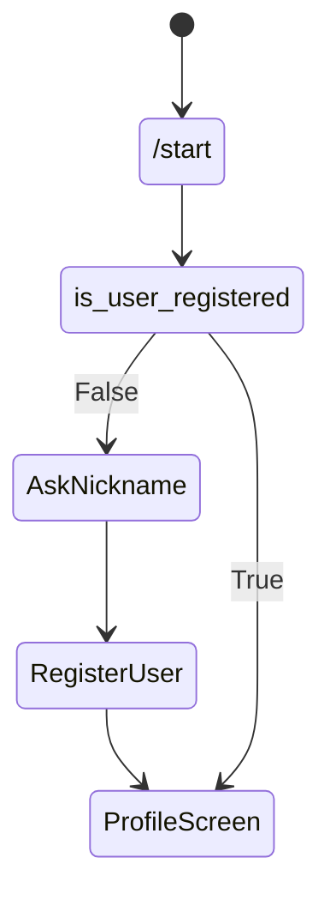
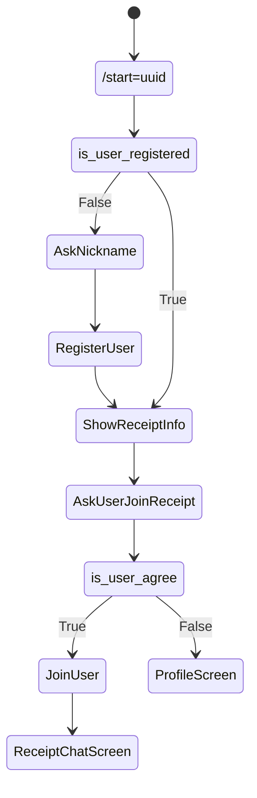

# States
## /start

## start={uuid}

# Dialogs details
## Registration Flow:
1. Asks nickname
2. Collect chat_id
3. call Register User interactor 
## ReceiptOnboardFlow:
1. Shows receipt title, creditor nickname
2. Asks are you shure with nuttons yes/no
3. Adds user to receipt or 
