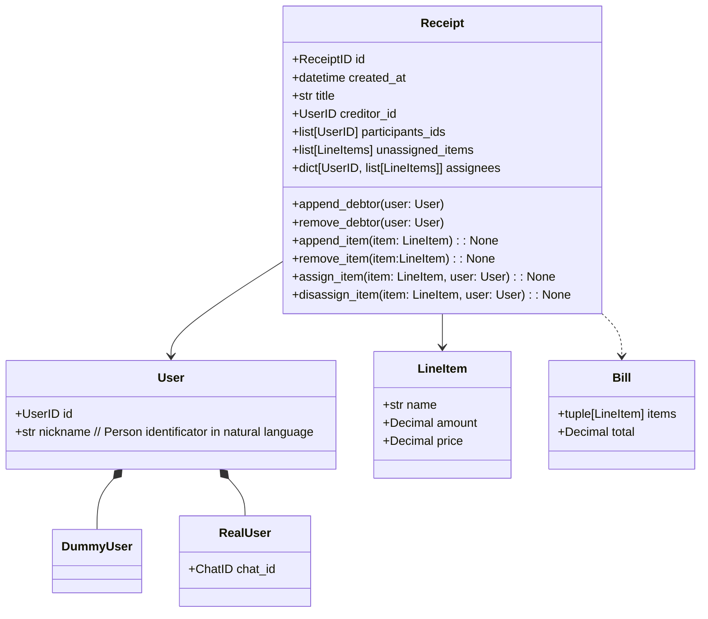

**Receipt** - DDD agregate of line-items and their assignees to users.
User creates Receipt and optionally sends invite-link to his firends for cooperative receipt management.
Participant is defined by existence in `assignees` map

**RealUser** - Alive user with external service account(Telegram/Clients API). Can operate with receipts he participates in

**DummyUser** - Virtual receipt participant. Can be assigned with line-items. Created for cases where some people can't use our service, but creditors wants to calculate debts or when new user wants to play with service to check what it can.

**LineItem** - Representation on line in physical receipts. Has amount as decimal so users can divide one whole item between them

**Bill** - Assigned items and total debt of specific participand