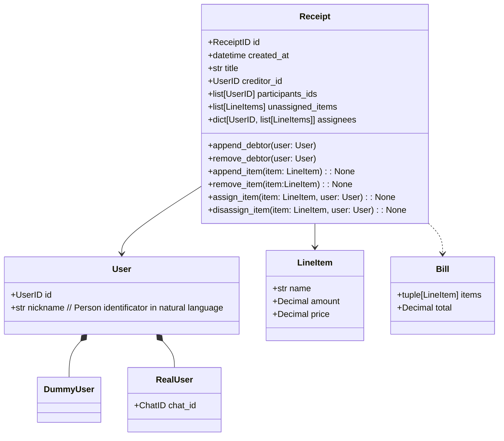

**Receipt** - A DDD aggregate representing line items and how they are assigned to users.
A user creates a receipt and optionally sends invite link to their firends for cooperative receipt management.
A participant is defined by their presence in the `assignees` map

**RealUser** - A real user with an external service account (e.g., Telegram or Clients API). Can operate on receipts they participate in.

**DummyUser** - Virtual receipt participant. Can be assigned line-items. Created for cases where part of group can't use our service, but the creditors wants to calculate debts for them or when new user wants to try the service.

**LineItem** - Represents a line in a physical receipt. Has an amount represented as a decimal so users can split a single item between them.

**Bill** - Assigned items and total debt of specific participand