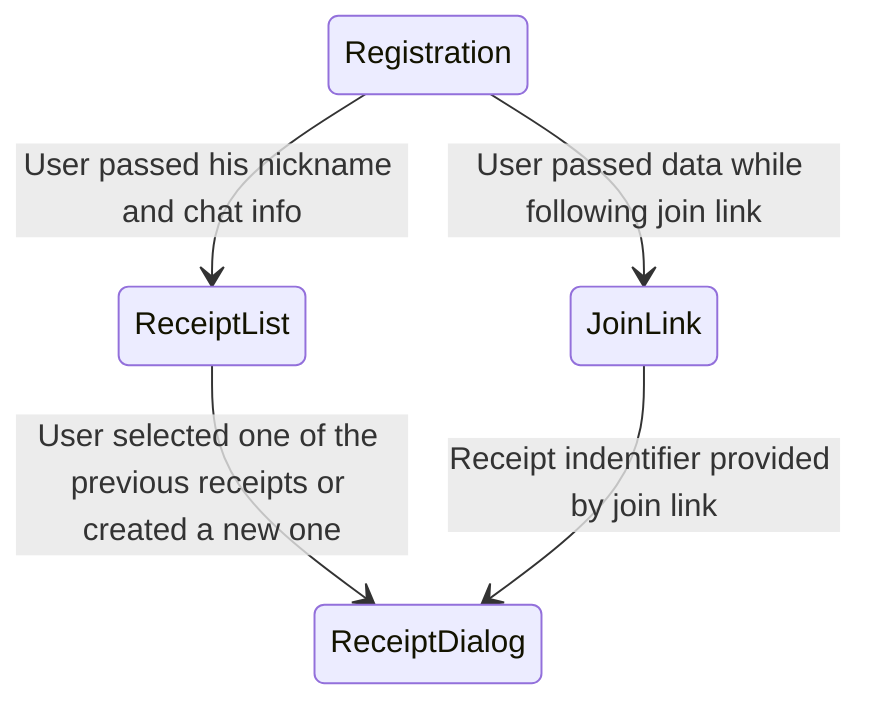
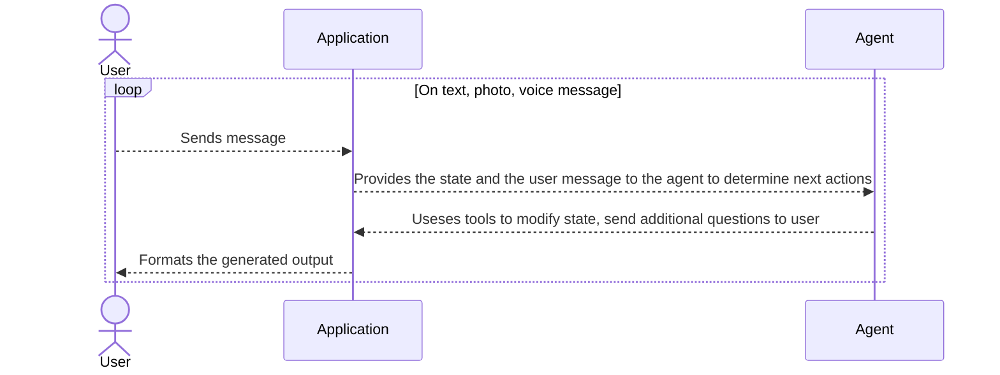

## Golden path

```mermaid
stateDiagram-v2

Registration --> ReceiptList: User passed his nickname and chat info
Registration --> JoinLink: User passed data while following join link
ReceiptList --> ReceiptDialog: User selected one of the previous receipts or created a new one
JoinLink --> ReceiptDialog: Receipt indentifier provided by join link    
```
## ReceiptDialog in detail

```mermaid
sequenceDiagram
actor User
participant Application #@{ "type" : "boundary" }
participant Agent #@{ "type" : "control" }

loop On text, photo, voice message
    User -->> Application: Sends message
    Application -->> Agent: Provides the state and the user message to the agent to determine next actions
    Agent -->> Application: Useses tools to modify state, send additional questions to user
    Application -->> User: Formats the generated output    
end
```
