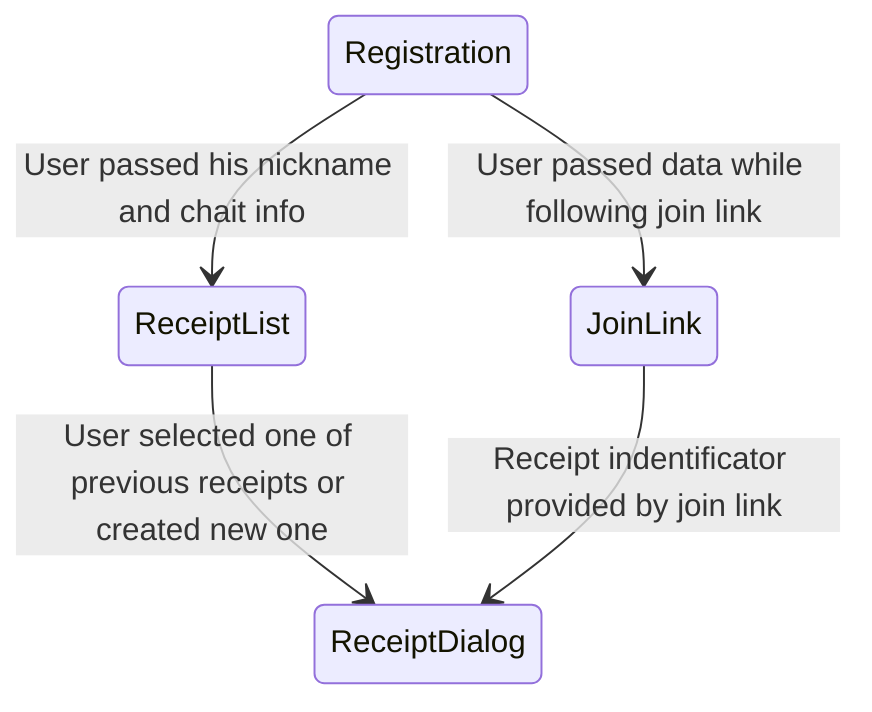
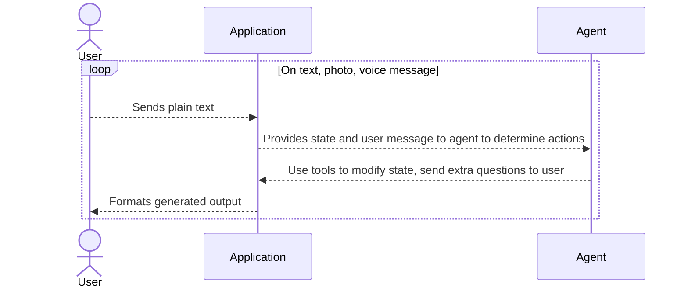

## Golden path

```mermaid
stateDiagram-v2

Registration --> ReceiptList: User passed his nickname and chait info
Registration --> JoinLink: User passed data while following join link
ReceiptList --> ReceiptDialog: User selected one of previous receipts or created new one
JoinLink --> ReceiptDialog: Receipt indentificator provided by join link    
```
## ReceiptDialog in details

```mermaid
sequenceDiagram
actor User
participant Application #@{ "type" : "boundary" }
participant Agent #@{ "type" : "control" }

loop On text, photo, voice message
    User -->> Application: Sends plain text
    Application -->> Agent: Provides state and user message to agent to determine actions
    Agent -->> Application: Use tools to modify state, send extra questions to user
    Application -->> User: Formats generated output    
end
```
