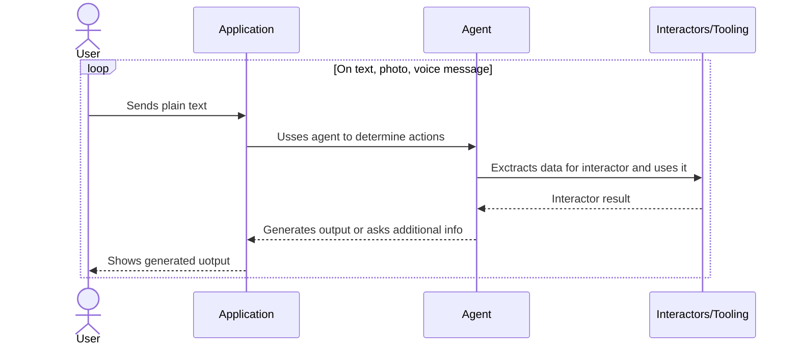

## append_items
**Input:**`line_items: tuple[LineItem]`
**Output:** `None or raises domain exception`
## delete_items
**Input:**`line_items: tuple[LineItem]`
**Output:** `None or raises domain exception`
## assign_items
**Input:**
`user_name: str, line_items: tuple[LineItem]`
or
`dict[str, tuple[LineItem]]`
**Output:** `None or raises exception`
## disassign_items
**Input:**
`user_name: str, line_items: tuple[LineItem]`
or
`dict[str, tuple[LineItem]]`
**Output:** `None or raises exception`

> [!faq] Questions
> - Do we need tool for getting current receipt state, so agent can remind itself or maybe return current state as tool result
> 	- This tool can be us, modificating agent memory on flight.
> - What can we do with two people with the same name
> - Any risks with requiring complex objects like `LineItem`
> -  What  input scheme is better to work with assignees