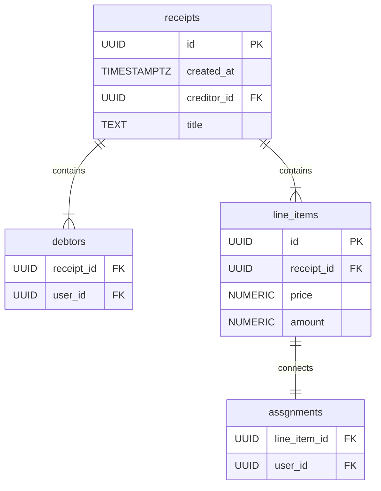

Our mentor agitated for relational database instead of No-SQL, so lets do some 1 to 1 comparison suitable for our case.

**MongoDB**

| ✅   | fast and intuitive way to implement aggregates | - `Receipt` is a natural **document aggregate** - `unassigned_items`, `assignees`, `debtors` map very cleanly to embedded arrays/maps - single-document atomic updates match DDD aggregate rules perfectly |
| --- | ---------------------------------------------- | ---------------------------------------------------------------------------------------------------------------------------------------------------------------------------------------------------------------- |
| ✅   | great fit for OLTP read by id + save tasks     |                                                                                                                                                                                                                  |
| ⚠️  | No FK and constrains                           | But in DDD this is already your responsibility                                                                                                                                                                   |
| ⚠️  | No schema                                      |                                                                                                                                                                                                                  |

**PostgreSQL**

| ❌   | unintuitive way to implement aggregates       |                                            |
| --- | --------------------------------------------- | ------------------------------------------------ |
| ✅   | Easy to maintain potential complex structures | - Relational queries - Many-to-many relations |
| ✅   | Enforses data                                 | Constrains, schema, FK                           |
| ✅   | OLAP is better                                | **IF** there will be any OLAP (NO)               |

Quick Receipt conсept:
