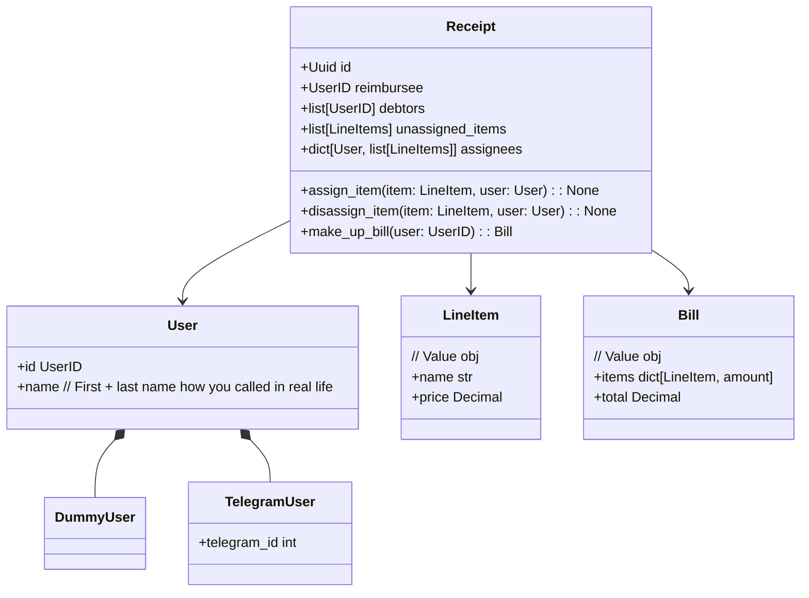

**Receipt** (Чек) - Группа объединяющая пользователей и товары из чека
Пользователь заводит Receipt, и опционально рассылает ссылку приглашение друзьям, чтобы они могли вместе параллельно делить чек.

**TelegramUser** (Пользак) - Живой пользователь, может создавать чеки, назначать товары из чека себе и другим

**DummyUser** (Пугало) - Заглушка пользователя, которую можно добавить к чеку, чтобы назначать на неё товары, если данный человек не может вступить в группу

**LineItem** (Товар) - Строчка в чеке. Презентует 1 конкретную единицу товара, если таких несколько - нужно создавать несколько дубликатов.

**Bill** (Счет) - Счёт за товары из чека для конкретного пользователя
