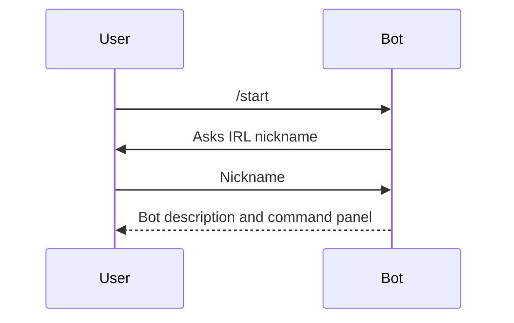
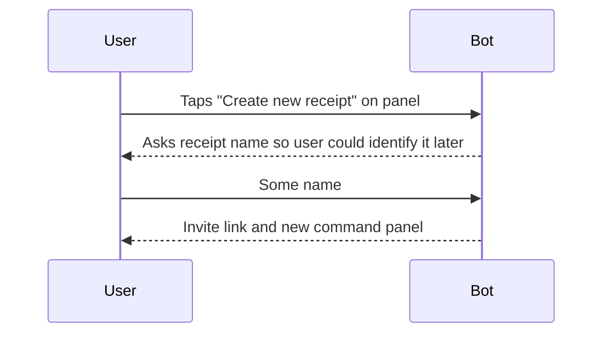
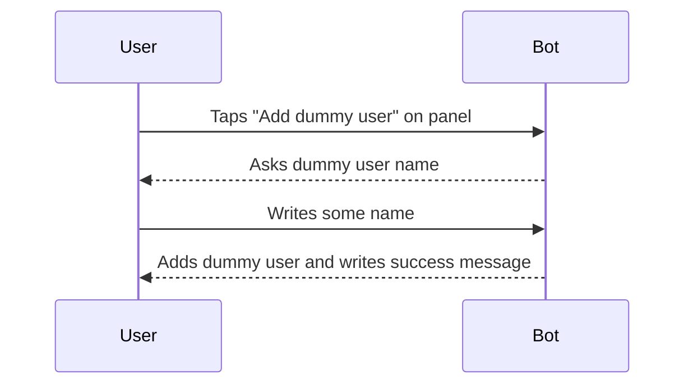
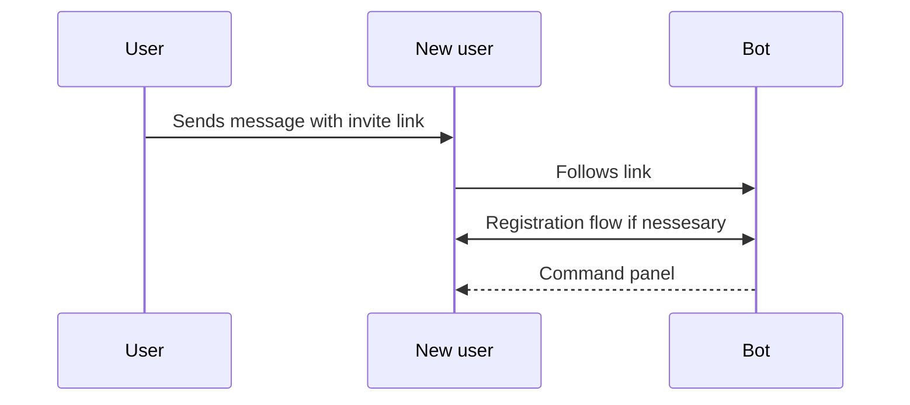

## Registration

**Command panel**
- Create new receipt
- List your receipts

## Receipt creation

**Command panel**
- Add dummy user(Добавить виртуального участника)
- Return to main menu
## Adding users to receipt
### Dummy user case

### Real user case

## Receipt lines 
**Chat options**
Users  send natural language messages to bot. 
We assume voice messages and photos by using wisper and prl
Our bot tools:
- Add unassigned lines
- Assign line to user
- Unassign line from user